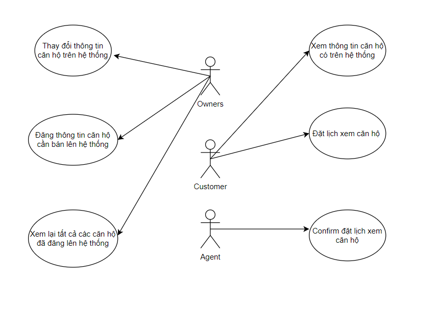

# DOCUMENT NGHIỆP VỤ ĐĂNG BÁN CĂN HỘ THỨ CẤP

## Ý tưởng
  - Cuộc sống ngày càng hiện đại ngày càng phát triển, ở thời hiện đại, kinh tế của con người
ngày càng vững, ông cha ta đã nói "An cư, lạc nghiệp", khi kinh tế ổn định
con người ta muốn sở hữu những tài sản có giá trị lớn, và trong đó có 
những dự án bất động sản. Và căn hộ chung cư là một tài sản được rất nhiều người lựa chọn để 
làm tổ ấm cho gia đình. Vì lượng người sở hữu căn hộ ngoài thị trường rất lớn nên sẽ có những chủ
căn hộ muốn thay đổi nơi ở, muốn nâng cấp căn hộ, nên họ muốn bán căn hộ đã qua sử dụng, nhưng ngoài
thị trường cũng có rất nhiều hệ thống, công ty đăng bán căn hộ đã qua sử dụng nhưng để lựa chọn ra đơn vị 
uy tín thì thực sự khó khăn!
  - Hiểu được vấn đề đó, Onehousing phát triển hệ thống đăng bán căn hộ đã qua sử dụng dành cho các chủ căn hộ 
có nhu cầu! Onehousing là nơi uy tín để các chủ căn hộ đặt niềm tin và giao tài sản cho Onehousing quản lý!
## Các chức năng chính
- Đăng thông tin bán căn hộ
  - Define thông tin
    - PROJECT
      - Id
      - Tên dự bán
      - Mô tả dự án
    - PROPERTY 
      - Id
      - Tên dự án [refer]
      - Ban công views
      - Tên tòa nhà
      - Số tầng
      - Mô tả căn hộ
      - Tổng diện tích nhà
      - Chiều dài nhà
      - Chiều rộng nhà
      - Số phòng ngủ
      - Số phòng tắm
      - Diện tích phòng khách 
      - Trạng thái sử dụng
      - Ảnh căn hộ [refer]
      - Thông tin pháp lý [refer]
      - Thông tin khoản vay [refer]
      - Chủ sở hữu [refer]
      - Nội thất [refer]
    - LOAN_INFOS
      - Id 
      - Số tiền vay
      - Trạng thái
    - GALLERIES
      - Id
      - Media_Type
      - Url
    - LEGAL_INFOS
      - Id
      - Trạng thái
    - OWNERS
      - Id
      - Họ Tên
      - Số điện thoại
      - Địa chỉ
      - Giới tính
    - FURNITURUES
      - Id
      - Tên tài sản
      - Số lượng
## UseCase
  